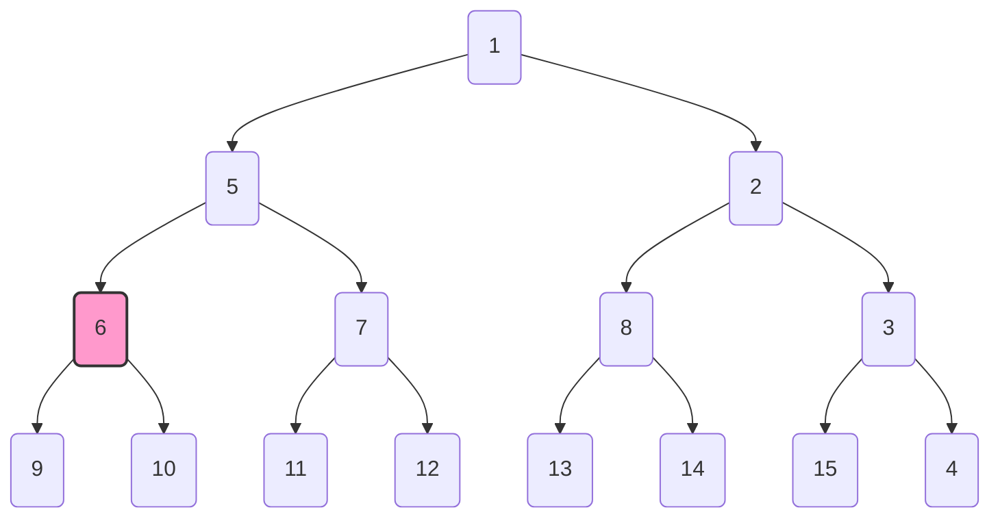

2025-02-19

Status: #child

Tags: [[cs401_algorithms]] 

# sol-hw2-cs401

## Question 1:
> Consider a sorted array $A$ of $n$ distinct numbers. $rotate(A)$ is any circular shift of the array by some value from $0$ to $n - 1$. For example if $A = [2, 5, 7, 8, 10, 12, 16]$.
> a possible value of $rotate(A)$ is $[7, 8, 10, 12, 16, 2, 5]$, obtained by 2 - left rotation.
> 
> Given any number $x$, give $O(\log{n})$ algorithm to determine whether $x$ is a member of $rotate(A)$. Your algorithm should have as low time complexity as possible. Can you solve $0(\log{n})$? 
### Solution:
#### Step 1 (Intuition):
Since the task requires to be done in $0(\log{n})$ time that means that there is a high probability of a binary search being implemented. 
Binary Search:
This has 3 pointers -> left, middle, right. If this was sorted vanilla binary search would be the solution, but for this we will need to implement a modified version of a binary search.

Now the graph of a **normal sorted array** would look like this where elements are in **increasing order**:
```tikz
\begin{document}
  \begin{tikzpicture}[domain=0:6]
    % Grid
    \draw[very thin,gray] (0,0) grid (6,6);

    % Axes
    \draw[->] (-0.5,0) -- (6.5,0) node[right] {$x$ (Index)};
    \draw[->] (0,-0.5) -- (0,6.5) node[above] {$y$ (Value)};

    
    % Line y = x
    \draw[color=red,thick] plot (\x,\x) node[right] {$y = x$};
  \end{tikzpicture}
\end{document}
```

**On the other hand** the graph for a **rotated sorted array** would look something like this:
```tikz
\begin{document}
  \begin{tikzpicture}
    % Grid
    \draw[very thin,gray] (0,0) grid (6,6);
	
    % Axes
    \draw[->] (-0.5,0) -- (6.5,0) node[right] {$x$ (Index)};
    \draw[->] (0,-0.5) -- (0,6.5) node[above] {$y$ (Value)};

    % Sorted array (y = x)
    \draw[blue,thick] (0,0) -- (3,3) node[above] {Before Pivot};

    % Rotated sorted array (starts lower, continues increasing)
    \draw[red,thick] (3.5,0) -- (6,4) node[above] {After Pivot};

    % Pivot marker
    \draw[dashed] (3.3,-0.5) -- (3.3,6) node[above] {Pivot};

  \end{tikzpicture}
\end{document}
```
#### Step 2 (Breaking the problem down):
This problem can be broken down into 2 major pieces.
Assuming that there are 2 sorted portions of the array given by the previous graph
- We are in the left sorted portion of the array -> target $>$ mid or target $<$ mid.
- We are in the right sorted portion of the array -> target $>$ mid or target $<$ mid.
$Q.$ How do we know if we are in the left or right sorted portion of the array?
$Ans.$ 
**Assumption**:
Doing binary search.
$L \longrightarrow$ value at index $0$.
$R \longrightarrow$ value at index $len(arr) - 1$.
$M \longrightarrow$ value at index $len(arr)/2$. 
$Sol.$ 
*Left Portion*
Defined as $L \leq M$
*Right Portion*
Defined as $R \leq M$
#### Step 3 (Algorithm):
$nums = rotate(A)$
$target = x \rightarrow \text{to determine whether it is in A or not}$ 
```python
def search(nums: List[int], target: int):
	l, r = 0, len(nums) - 1

	while l <= r:
		mid = (l + r) // 2
		if target == nums[mid]:
			return mid

		# Left sorted portion
		if nums[l] <= nums[mid]:
			if target > nums[mid] or target < nums[l]:
				l = mid + 1
			else:
			r = mid - 1
		# right sorted portion
		else:
			if target < nums[mid] or target > nums[r]:
				r = mid - 1
			else:
				l = mid + 1	
	return -1
```

## Question 2:
> Consider the heap implementation of a priority queue. Let H be a heap on n elements. $Delete(H, i)$ deletes the element in position i. Construct an example heap with at least 15 elements, and identify a position i with the property that $Delete(H, i)$ results in the execution of calls to Heapify-up. You must draw your example heap as a binary tree and identify the element at position i. Then justify that your example satisfies the required property.

### Solution:
Heap $\longrightarrow$ $H = [1, 5, 2, 6, 7, 8, 3, 9, 10, 11, 12, 13, 14, 15, 4]$ 
We will delete at index $3$ which is $6$ 
When we perform Delete(H, 3):
1. The element 6 at index 3 is removed.
2. Note that, H[14] = 4, is moved to index 3.
3. The parent of index 3 is at index `(3-1)/2 = 2/2 = 1`
4. Since 4 < 5, the heap property is violated, so Heapify‑up is invoked:
   - Compare H[3] (now 4) with H[1] (5). Since 4 < 5, swap them.
   - Now H[1] becomes 4 and H[3] becomes 5.
   - Checking H[1]'s parent at index 0. Since 1 < 4, the heap property conserved.
Thus, deleting the element at index 3 results in a call to Heapify‑up.

**Heap Drawn:**


## Question 3:
> How many topological orderings does graph 3.10 have?

### Solution:
1. b comes before d:
	1. b first -> next node c or d
	2. if c comes next order is b, c, d, e
	3. if d comes next order is b, d, c, e or b, d, e, c
2. d comes before b:
	1. reversing the b, c, and d, e the orderings mirror case 1
	2. Three valid sequences are d, e, b, c, and d, b, e, c, and d, b, c, e
$\therefore$ In total there are 6 valid orderings.

## Question 4
### Solution:
```python
def isCycleUtil(v, adj, visited, parent):
    # Mark the current node as visited
    visited[v] = True
    # Recur for all vertices adjacent to this vertex
    for i in adj[v]:
        if not visited[i]:
            parent[i] = v  # set parent of i to v
            result = isCycleUtil(i, adj, visited, parent)
            if result is not None:
                return result
        elif i != parent[v]:
            # Cycle detected: reconstruct the cycle starting from i up to v
            cycle = []
            cur = v
            cycle.append(i)  # add the start vertex of the cycle
            # backtrack until we reach i
            while cur != i:
                cycle.append(cur)
                cur = parent[cur]
            cycle.append(i)  # to complete the cycle
            return cycle

    return None

def isCycle(adj):
    V = len(adj)
    visited = [False] * V
    parent = [-1] * V

    for u in range(V):
        if not visited[u]:
            result = isCycleUtil(u, adj, visited, parent)
            if result is not None:
                return result  # Return the found cycle
    return None
```

## Question 5:
### Solution:
```python
def dfs(g, start):
	visited = set()
	parent = {}

	def visit(n):
		visited.add(n)
		for v in g[n]
			if v not in visited
				parent[v] = n
				print(f"Treee edge: ({n}, {v})")
				visit(n)
	visit(start)
```

DataStructures:
- g -> adjecenty list rep of graph
- visited -> set to keep track of visited nodes
- parent -> dictto keep track of parent child relationship.